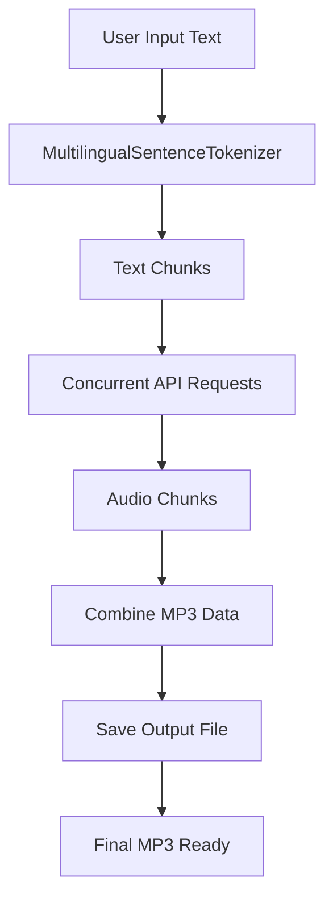

## 🚀 Sarvam TTS

**`sarvam-tts`** is a lightweight, production-ready Python client for the Sarvam AI Text-to-Speech API. It converts text into natural-sounding speech across multiple Indian languages, while preserving sentence structure using an advanced multilingual tokenizer.

> Ideal for developers building voice experiences, educational tools, accessibility features, and multilingual narration.

---

## ✨ Features

- 🎙️ Multilingual speech generation for Indian languages
- 🔧 Easy-to-use `SarvamTTS` client with configurable voice, pace, temperature, and sample rate
- 🧠 Smart sentence tokenization using `MultilingualSentenceTokenizer`
- ⚡ Concurrent chunk generation for more reliable TTS output
- 🧩 Handles abbreviations, URLs, email addresses, and multilingual scripts
- 💾 Saves output as MP3 directly with a single API call

---

## 📦 Project Structure

| File | Purpose |
|---|---|
| `sarvamtts.py` | Main TTS client and API integration |
| `multilingual_tokenizer.py` | Advanced sentence tokenizer for Indian languages |
| `README.md` | Project documentation |
| `LICENSE` | MIT license |

---

## 📌 Quick Start

### 1. Clone Respository
```bash
git clone https://github.com/sujalrajpoot/sarvam-tts.git
```

### 2. Install dependencies

```bash
pip install -r requirements.txt
```

### 3. Run the example script

```bash
python sarvamtts.py
```

### 4. Use the library from your application

```python
from sarvamtts import SarvamTTS

client = SarvamTTS(verbose=True)
result = client.tts(
    text="Hello from Sarvam TTS!",
    language="english",
    voice="shreya",
    pace=1.0,
    temperature=0.6,
    sample_rate=22050,
    output_filepath="output.mp3"
)
print(result)
```

---

## 🧠 Usage Guide

### Available voices

The library currently supports the following voice names:

`shreya`, `shubh`, `manan`, `ishita`, `priya`, `suhani`, `ashutosh`, `ritu`, `amit`, `sumit`, `pooja`, `simran`, `rahul`, `kavya`, `ratan`, `shruti`, `aditya`, `soham`, `rehan`, `vijay`, `tarun`, `anand`, `aayan`, `rohan`, `dev`, `sunny`, `kabir`, `varun`, `neha`, `mani`, `mohit`, `rupali`, `advait`, `roopa`, `tanya`, `gokul`, `kavitha`

### Supported languages

| Language | Code |
|---|---|
| English | `en-IN` |
| Hindi | `hi-IN` |
| Bengali | `bn-IN` |
| Tamil | `ta-IN` |
| Telugu | `te-IN` |
| Kannada | `kn-IN` |
| Malayalam | `ml-IN` |
| Marathi | `mr-IN` |
| Gujarati | `gu-IN` |
| Punjabi | `pa-IN` |
| Odia | `od-IN` |

### TTS method parameters

| Parameter | Type | Default | Description |
|---|---|---|---|
| `text` | `str` | required | Input text to convert to speech |
| `language` | `str` | required | Target language name |
| `voice` | `str` | required | Voice speaker name |
| `pace` | `float` | `1.0` | Speech speed, between `0.5` and `2.0` |
| `temperature` | `float` | `0.6` | Voice randomness, between `0.0` and `1.0` |
| `sample_rate` | `int` | `22050` | Output sample rate: `22050`, `8000`, or `48000` |
| `output_filepath` | `str` | `sarvam-tts.mp3` | Output file path |

---

## 🌐 Architecture Overview



### How it works

1. `SarvamTTS` accepts text and configuration options.
2. `MultilingualSentenceTokenizer` splits the text into language-aware sentence chunks.
3. Each chunk is sent concurrently to the Sarvam AI TTS endpoint.
4. The binary audio chunks are collected and merged.
5. The final MP3 is written to disk.

---

## 🔧 Tips & Best Practices

- 💡 Prefer shorter text chunks for faster and more reliable audio generation.
- 💡 Use a stable internet connection to avoid request retries.
- 💡 For production usage, handle exceptions around `client.tts(...)` to retry or log failures.
- 💡 If you need a custom voice or new language, add support in the `get_voices` and `get_languages` methods.

> Note: This project relies on the Sarvam AI public API behavior. API responses may change over time.

---

## 🧪 Testing & Validation

To validate the tokenizer behavior quickly, you can run:

```bash
python multilingual_tokenizer.py
```

This will print language-specific sentence splitting results for sample text blocks.

---

## 🤝 Contributing

Contributions, bug reports, and feature requests are welcome!

1. Fork the repository
2. Create a branch: `git checkout -b feature/my-improvement`
3. Commit your changes
4. Open a pull request

### Suggested improvements

- Add packaging support with `pyproject.toml`
- Provide a `requirements.txt`
- Add a CLI wrapper for easier command-line usage
- Extend voice / language configuration through a YAML or JSON file

---

## 📄 License

This project is licensed under the **MIT License**. See `LICENSE` for details.
